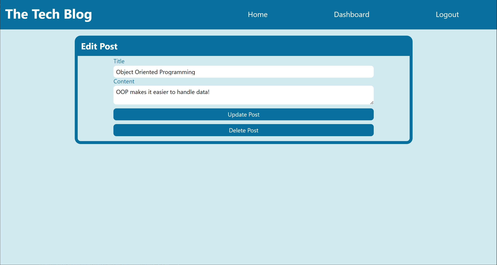

# tech-blog

## Description

**Goal**: To create a Content Management System using a Model View Controller pattern to run a tech blog web application.

The world of tech is a large one that can't always be captured in documentation. A tech blog creates a community interested in the same general topic of technology, and within that community, many interesting experiences, problems, opinions, debates, etc. can happen. These sites are useful for everyone in the industry as well as anyone interested in technology in general.

## Tech Stack
- HTML
- CSS
- JavaScript
- JSON
- Node.js
- npm
    - express
    - express-handlebars
    - express-session
    - MySQL2
    - Sequelize
    - dotenv
    - bcrypt
    - connect-session-sequelize
- Heroku

## Development
1. Create repository and file structure
1. Initialize npm and download dependencies
1. Create schema and map out model relationships
1. Create connection to database
1. Create models and seeds for database
1. Wireframe webpages and determine moving parts
1. Create front-end CSS and JS files
1. Create handlebar pages for webpage rendering along with helper functions
1. Write main server file
1. Write controller paths
1. Debug and connect moving parts to create working application

## Deployment

[Link to Deployment]()